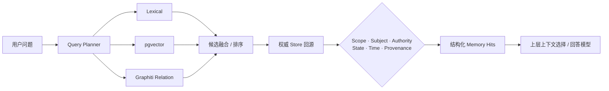

<div align="center">

# Doppel · 分身

### 为长期个人 Agent 设计的个人记忆与上下文中枢

让 Agent 在长期、多会话、多用户环境中记住**正确的人、正确的时间、正确的关系与原始证据**。

[](https://github.com/big-orange947/Doppel/actions/workflows/ci.yml)


[](LICENSE)

[快速开始](#快速开始) · [核心能力](#核心能力) · [检索架构](#面向个人记忆的检索架构) · [质量与测评](#质量与测评) · [文档](#文档导航)

</div>

---

Doppel 不是一个通用向量数据库包装器，也不是负责回复、工具调用和消息路由的 Agent Runtime。

它专注于一件事：成为长期个人 Agent 的**个人记忆权威核心**——把聊天、文件、日历、邮件或工具
观察中的个人事实、经历、偏好、计划与关系，整理为带有作用域、时间、说话人、事实权威和来源证据
的长期记忆，再以结构化结果交给上层 Agent 使用。

```text
“我临时去北京出差两个月”
               │
               ▼
Doppel 知道这是有有效期的临时状态，而不是永久覆盖“长期住在上海”
               │
               ▼
五个月后查询当前住处 → 上海
查询出差期间的住处     → 北京
```

## 为什么是 Doppel

| 长期 Agent 的真实问题 | Doppel 的处理方式 |
|---|---|
| 多个用户、群聊和私聊容易串台 | Store 只执行 **exact scope** 查询；跨会话读取必须由 host 明确授权 |
| Agent 自己说过的话被误记成用户事实 | 区分 actor、subject 与 fact authority；Agent 输出默认不能成为 owner 事实 |
| “曾经、现在、计划、取消、临时”被压成一条静态文本 | 记录时间状态、有效区间、纠正、撤回、冲突与生命周期 |
| 向量相似不等于关系正确 | 词法、向量、时间与类型化关系检索分工明确，最终回到权威 Store 复核 |
| 记忆命中了，却不知道从哪里来的 | 每条派生记忆保留消息、事件、处理器与版本化 provenance |
| 一个通用 memory API 无法支撑个人 Agent | 提供个人事实、事件计数、关系、风格、材料装配和治理协议，同时保持 host 可控 |

## 适合什么场景

- **长期个人助手**：在不同时间和来源中维护主人的事实、偏好、关系、经历、计划与承诺。
- **聊天代理 / IM Agent**：安全处理私聊、群聊、不同联系人和不同平台的长期记忆。
- **多 Agent 个人系统**：主 Agent 获得经过授权的全局个人记忆；子 Agent 只接收当前任务或会话范围。
- **跨会话个人信息中枢**：由 host 明确把会话记忆提升到 user scope，并在新会话中重新使用。
- **可审计的个性化生成**：为上层模型提供结构化事实、关系、冲突、原话样本与风格指导。
- **自定义个人记忆产品**：替换 Store、Processor、Planner、Embedding、Reranker 或材料渲染器。

不适合直接拿 Doppel 替代：

- Agent 的短期上下文窗口、工作流 checkpoint 或 scratchpad；
- 完整文档库和通用知识库；
- 日历、邮件、金融账户等实时业务系统本身；
- Agent 编排、工具执行、消息发送和最终回答生成。

完整边界见 [Personal memory ownership boundary](docs/personal-memory-boundary.md)。

## 核心能力

### 1. 不串台的精确作用域

`MemoryScope` 可以表达用户、Agent、平台、私聊/群聊、会话、联系人以及自定义维度。所有 Store
操作都绑定完整 `scope_key`，不会自行扩大读取范围。

```python
from doppel_memory import MemoryScope

conversation = MemoryScope(
    user_id="owner-42",
    agent_id="personal-agent",
    platform="qq",
    chat_type="private",
    chat_id="contact-7",
)

# 跨会话读取不是隐式行为，由 host 显式选择授权范围。
authorized_scopes = [conversation, conversation.user_scope()]
```

这意味着同一个进程可以处理多个账号、用户和会话，但调用方只能读取自己明确传入的 scope。
Doppel 提供隔离原语，应用负责决定主 Agent、子 Agent 和具体任务分别拥有哪些 scope。

### 2. 说话人、主体与事实权威分离

Doppel 不把“出现在聊天记录里”直接等同于“这是主人的事实”。记忆会区分：

- 谁说的：`actor`；
- 事实描述的是谁：`subject` / `subject_id`；
- 证据权威：owner、contact、agent output、imported source 等；
- 原始消息或事件：source message/event；
- 哪个抽取器或任务产生了它：processor/model/version。

这套边界可以阻止群成员的陈述、机器人回复或跨用户数据被静默提升成主人的长期事实。

### 3. 时间感知与可演化记忆

Doppel 的个人记忆不是只含正文的 chunk。它可以表达：

- current / historical / planned / timeless；
- `valid_from` / `valid_to`；
- correction / retraction；
- candidate / confirmed / superseded / expired；
- 相互矛盾但暂时无法裁决的 conflict；
- 强化、显式短期衰减、归档与恢复。

查询层把 `lookup / list / count` 与 `current / prior / planned / as-of / interval` 分开，避免把
“去年去过几次”和“现在住哪里”压成同一种搜索。

### 4. 词法、向量、时间与关系联合检索

Doppel 支持从轻量到高配置的渐进部署：

| 层级 | 组合 | 适用场景 |
|---|---|---|
| 最小配置 | SQLite + 词法检索 | 本地开发、小规模机器人、协议验证 |
| 服务端配置 | PostgreSQL Store | 多进程、共享连接池、服务端部署 |
| 语义增强 | PostgreSQL + pgvector | 中文语义改写、近义表达和高召回候选发现 |
| 时间/关系增强 | Neo4j + Graphiti relation index | 实体关系、时点状态、类型化关系检索 |
| 最高质量 | PostgreSQL + pgvector + Graphiti + Planner/Reranker | 长期个人 Agent 的混合候选召回与关系约束 |

向量和图始终只是**派生候选索引**。命中的 memory ID 必须重新加载权威 Store，并重新检查 scope、
subject、authority、生命周期、时间和 provenance。

### 5. 可追溯的抽取、整理与治理

```text
消息 / 事件 / 文件摘要
        │
        ▼
MemoryProcessor / PersonalMemoryAnalyzer
        │ 只提出 proposal，不直接写 Store
        ▼
ProposalWriter
        │ scope · authority · evidence · policy · idempotency
        ▼
Authoritative Store
        │
        ├── Consolidation：合并、纠正、冲突
        ├── Governance：强化、衰减、归档、恢复
        └── IndexMaintainer：同步 pgvector / Graphiti 派生索引
```

在线 Processor 保持无状态；需要统计历史的风格、互动模式或长期聚合通过周期 BatchTask 运行。
模型只负责提出结构化判断，最终写入权限始终留在受约束的 host 管线中。

### 6. 结构化内容与风格材料

- `ContentPart` / `MediaRef` 可以表示文字、文件、图片等输入；是否解析和是否形成长期记忆由 host 决定。
- `ContentResolver` 可以把外部内容解析为可引用摘要，不要求把完整文件复制进记忆库。
- `StyleMiner` 从 owner 历史原话形成可观察风格统计。
- `StyleProfessor` 把 profile 编译成受限生成指导，不让风格材料覆盖事实与安全约束。
- `MaterialBundle` 向上层提供事件、背景、关系、风格样本、指导与 provenance，而不是强制某种 prompt。

## 面向个人记忆的检索架构



Planner 负责把自然语言问题转换为结构化检索意图，例如：

- 当前事实还是历史事实；
- 单条 lookup、完整 list，还是必须精确的 count；
- 查询时间点或时间区间；
- 显式实体与关系提示；
- host ontology 中允许的关系类型。

Planner **不选择 scope，不生成答案，也不能绕过 Store 安全门**。确定性 Planner 不包含饮食、旅行、
住所、工作等 benchmark 领域词典；更强语义规划由可替换的 Reference Planner 完成。

### 有界关系多跳

对于“物品 → 保管人 → 保管人所在地”这类问题，实验性 `RelationPathIndex` 已支持最多两跳的
类型化、定向路径。每一跳都必须单独通过：

```text
exact scope → time → Edge → Episode → memory_id → Store revalidation
```

真实 Neo4j 开发消融中，两跳路径把证据召回率从 `0.667` 提升到 `1.000`，完整证据率从
`0.500` 提升到 `1.000`，同时保持 0 forbidden hit、0 scope leakage 和 0 provenance failure。

自然语言 Planner v3 与路径执行目前仍是 **module-only experimental**：它们没有接入默认查询引擎，
也不会静默改变 v1/v2 Planner。详见
[关系路径实测报告](benchmarks/reports/personal-relation-path-live-2026-09-19.md)。

## 快速开始

### 安装

项目目前处于 Alpha，建议先从源码安装：

```bash
git clone https://github.com/big-orange947/Doppel.git
cd Doppel
pip install -e .
```

按需安装可选后端：

```bash
pip install -e ".[postgres]"   # PostgreSQL / pgvector 客户端
pip install -e ".[graphiti]"   # Graphiti + Neo4j + FastEmbed
pip install -e ".[dev]"        # 测试、Ruff、Pyright
```

### 30 秒体验

```python
import asyncio

from doppel_memory import ChatMessage, DoppelClient, MemoryScope


async def main() -> None:
    memory = DoppelClient(backend="sqlite", database="doppel.sqlite3")

    scope = MemoryScope(
        user_id="owner-42",
        agent_id="personal-agent",
        platform="qq",
        chat_type="private",
        chat_id="contact-7",
    )

    await memory.ingest_messages(
        scope,
        [
            ChatMessage.of(
                "owner",
                "我下个月会去北京出差两个月，之后还是回上海住。",
                "2026-09-21T10:00:00+08:00",
                event_id="message-1",
            ),
            ChatMessage.of(
                "contact",
                "到了北京记得告诉我。",
                "2026-09-21T10:01:00+08:00",
                event_id="message-2",
            ),
        ],
    )

    # 轻量召回：显式传入允许读取的 scope。
    hits = await memory.recall("北京出差", [scope])
    for hit in hits:
        print(hit.fact, hit.memory_id)

    # 给上层 Agent 的结构化材料；默认 renderer 只是便利工具，可以替换。
    bundle = await memory.materials(scope, query="最近有什么出行安排？")
    print(bundle.render())

    await memory.close()


asyncio.run(main())
```

也可以直接运行：

```bash
python examples/basic.py
```

### 时间感知的个人记忆查询

```python
from datetime import UTC, datetime

result = await memory.query_personal_memory(
    "去年一共旅行了几次？",
    [scope, scope.user_scope()],
    now=datetime.now(UTC),
    calendar_timezone="+08:00",
    trace_limit=100,
)

print(result.count.status, result.count.value)
for hit in result.hits:
    print(hit.record.content, hit.candidate_evidence)
```

`count` 不会拿 top-k 搜索结果假装完整集合。缺少稳定事件标识或读边界不完整时，它会返回
`indeterminate`，而不是给出看似精确的错误数字。

### 使用 OpenAI-compatible 模型

Doppel 自带不依赖厂商 SDK 的结构化输出 adapter，可连接 OpenAI-compatible
`/chat/completions` endpoint。API key 只通过构造参数传入，不进入配置指纹、计划、缓存或错误文本。

```bash
set DOPPEL_MODEL=your-model
set DOPPEL_API_KEY=your-key
set DOPPEL_OPENAI_BASE_URL=https://your-endpoint.example/v1
python examples/openai_compatible.py
```

PowerShell 使用：

```powershell
$env:DOPPEL_MODEL = "your-model"
$env:DOPPEL_API_KEY = "your-key"
$env:DOPPEL_OPENAI_BASE_URL = "https://your-endpoint.example/v1"
python examples/openai_compatible.py
```

## 后端与能力状态

### 权威 Store

| 后端 | 状态 | 典型用途 |
|---|---|---|
| `InMemoryStore` | Stable | 单元测试、临时任务 |
| `SQLiteStore` | Stable / 默认参考实现 | 本地 Agent、单实例部署 |
| `PostgreSQLStore` | Provisional | 多进程服务端、共享连接池 |
| 自定义 `MemoryStore` | Conformance-gated | 接入已有基础设施 |

### 派生索引

| 索引 | 状态 | 作用 |
|---|---|---|
| `PostgreSQLVectorIndex` | Provisional | pgvector 语义候选召回 |
| `GraphitiSemanticIndex` | Experimental | Graphiti hybrid 兼容路径 |
| `GraphitiRelationIndex` | Experimental | 类型化关系与时间候选 |
| `RelationPathIndex` | Experimental | 最多两跳的有界关系路径 |

派生索引不拥有记忆。权威状态转换、删除、冲突、时间与权限始终由 Store 决定。

## 质量与测评

Doppel 不用单一“准确率”掩盖不同层的问题。仓库内的评测把以下责任分开：

- 抽取：是否从消息中形成正确的个人记忆；
- 整理：重复、纠正、撤回和无依据冲突如何处理；
- Planner：是否识别 operation、时间、实体与关系；
- 候选召回：词法、向量和图是否找到所需证据；
- 安全门：scope、subject、authority、state、time、provenance；
- 回答：候选是否足以证明答案——当前与检索指标明确分离。

关键原则：**检索到相关上下文，不等于 Doppel 宣称它证明了答案。**
`PersonalMemoryQueryHit.candidate_evidence.answer_support` 固定为 `unassessed`，最终证据判断属于可选
verifier 或上层回答模型。详细说明见 [Retrieval evaluation boundary](docs/retrieval-evaluation.md)。

代表性验证：

| 验证 | 当前结论 |
|---|---|
| Store conformance | InMemory、SQLite、PostgreSQL 共享同一契约测试 |
| 多租户隔离 | 评测中的 scope leakage 必须为 0，不能用召回率抵消 |
| pgvector / Graphiti | 每个候选都进行权威 Store 回源复核 |
| 类型化关系检索 | typed oracle 结构上限与自然语言 Planner 质量分轨测量 |
| 两跳关系路径 | 26 条 live Neo4j 结构消融，完整证据率 0.500 → 1.000 |
| 异构最高配置盲测 | 9,216 条记忆、480 条查询：Recall@5 0.998、完整证据@10 1.000、MRR 0.933，安全违规为 0 |
| 回归检查 | Python 3.11/3.12、pytest、Ruff、Pyright、版本化结果 schema |

评测入口与完整限制见 [benchmarks/README.md](benchmarks/README.md)。数据集在冻结前都明确标记
`frozen=false`、`publication_ready=false`，不会把开发集数字包装成公开质量结论。

## API 分层

| 层 | 入口 | 面向对象 |
|---|---|---|
| Stable core | `MemoryScope`、`MemoryRecord`、`MemoryStore`、`DoppelClient` | 普通接入方 |
| Provisional | Personal query、consolidation、governance、pgvector | 愿意跟随 minor 版本迁移的接入方 |
| Module-only experimental | Graphiti、多跳路径、Planner v3 | 评测与高级实验，不承诺兼容 |

应用应优先从包根导入。稳定和 provisional 名单由
[`docs/public-api.json`](docs/public-api.json) 记录并由测试锁定。详细规则见
[API stability policy](docs/api-stability.md)。

## 与 Agent Runtime 的协作边界

一个推荐的多 Agent 结构是：

```text
                     ┌──────────────────────────┐
                     │ 主 Agent / Personal Agent │
                     │ 可获得授权后的用户级记忆   │
                     └────────────┬─────────────┘
                                  │ host policy
                  ┌───────────────┴───────────────┐
                  ▼                               ▼
       会话子 Agent A                    会话子 Agent B
       仅收到 scope A                    仅收到 scope B
                  │                               │
                  └───────────────┬───────────────┘
                                  ▼
                       Doppel authoritative Store
```

Doppel 提供 scope、证据和检索材料，但不接管：

- 子 Agent 的创建与销毁；
- 上下文窗口清理；
- task progress 汇报；
- token budget；
- prompt 组装策略；
- 是否在某一轮对话触发记忆查询。

未来的上下文选择与装配层会建立在现有结构化命中和权限边界之上，而不会把 Agent 编排塞进 Store。

## 文档导航

| 文档 | 内容 |
|---|---|
| [设计说明](docs/design.md) | 核心不变量、三层 API、Store 与批处理协议 |
| [个人记忆边界](docs/personal-memory-boundary.md) | Doppel 拥有什么、不拥有什么 |
| [候选融合](docs/candidate-fusion.md) | lexical / vector / relation 候选如何组合 |
| [检索评测边界](docs/retrieval-evaluation.md) | candidate、evidence 与 answer 的区别 |
| [证据验证](docs/evidence-verification.md) | 可选 verifier 协议与安全边界 |
| [查询诊断](docs/query-diagnostics.md) | trace 与召回调试 |
| [个人记忆重排](docs/personal-memory-reranking.md) | host-supplied reranker |
| [API 稳定性](docs/api-stability.md) | stable / provisional / experimental |
| [Benchmark 指南](benchmarks/README.md) | 数据集、运行方式、门禁和报告 |
| [变更记录](CHANGELOG.md) | 版本演进与迁移说明 |

## 项目状态与下一步

Doppel 当前版本为 **v0.8.3 Alpha**。核心 Store、scope、provenance、生命周期与基础材料 API 已经稳定；
个人记忆智能、混合检索和治理处于 provisional；Graphiti 与多跳路径仍是 experimental。

接下来的重点不是增加更多特定场景规则，而是：

1. 扩大并冻结个人记忆抽取、时间、关系和多跳 Planner 的 held-out / adversarial 数据集；
2. 基于 Planner v3 密封评测暴露的超界拒绝问题，验证带显式 `execute/abstain` 决策的 V4，并建设全新的 V2 dev / sealed 语料；
3. 在 PostgreSQL + pgvector + Graphiti 已通过冻结异构检索门禁后，继续验证多实例可靠性、长时间索引一致性与竞争状态延迟；
4. 增加上下文选择与装配协议，让上层 Agent 按任务需要获取最小充分记忆；
5. 在核心质量稳定后，再建设可视化记忆管理、用户增删改查和文档补充界面；
6. PyPI 发布放在协议与质量门进一步收敛之后。

## 开发

```bash
git clone https://github.com/big-orange947/Doppel.git
cd Doppel
pip install -e ".[dev]"

pytest -q
ruff check .
pyright
```

内置后端可以运行独立 conformance CLI：

```bash
doppel-conformance --backend memory
doppel-conformance --backend sqlite
```

第三方 Store 在自己的测试中调用 `audit_store(my_store)`，并通过
`StoreConformanceConfig.required_capabilities` 声明必须验证的可选能力。

提交扩展前，请阅读 [API stability policy](docs/api-stability.md) 和
[Personal memory ownership boundary](docs/personal-memory-boundary.md)。

## License

[MIT](LICENSE)
